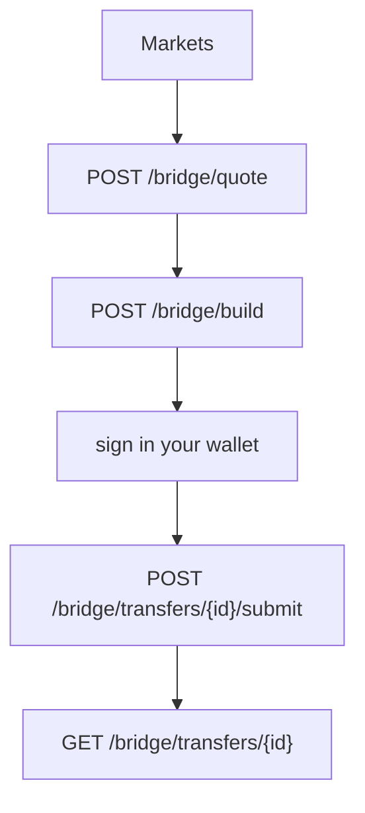

Base URL `https://api.bridg.now/v1`. No API key. Every amount is a string in the asset's atomic units.

## Markets

| Endpoint | Returns |
| --- | --- |
| [`GET /bridge/source-chains`](/api-reference/markets/source-chains) | Every chain a transfer can start from. |
| [`GET /bridge/routes`](/api-reference/markets/routes) | Which venues serve a corridor, and with which assets. |
| [`GET /bridge/venues`](/api-reference/markets/venues) | Every venue, whether it is on, and what it can sign. |

## Transfers

| Endpoint | Does |
| --- | --- |
| [`POST /bridge/quote`](/api-reference/quote/quote) | Prices the transfer across every venue. Returns `best`, `bestByTime` and the full ranked table. |
| [`POST /bridge/build`](/api-reference/quote/build) | Turns a quote into the unsigned transactions your wallet signs. |
| [`POST /bridge/transfers/{id}/submit`](/api-reference/quote/submit) | Takes the signed transaction, or the hash of one you already sent. |
| [`GET /bridge/transfers/{id}`](/api-reference/quote/transfer) | The transfer's status until it is delivered. |

Hyperliquid is a destination chain like any other: `toChain: "hypercore"`. See [Hyperliquid](/concepts/hyperliquid).

The OpenAPI 3.1 document is at [`/v1/openapi.json`](https://api.bridg.now/v1/openapi.json). The [TypeScript SDK](/sdk) wraps these seven calls.
