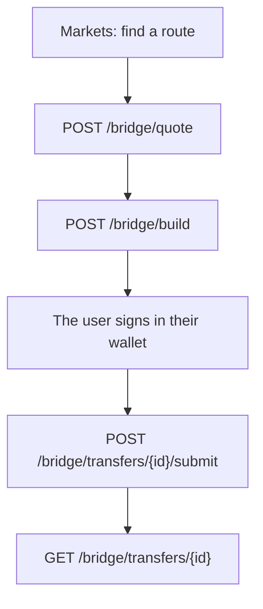

The base URL is `https://api.brdg.now/v1`. There is no API key. Requests and responses are JSON, and every token amount is a string in the token's smallest unit.

```mermaid
flowchart TD
    M["Markets: find a route"] --> Q["POST /bridge/quote"]
    Q --> B["POST /bridge/build"]
    B --> S["The user signs in their wallet"]
    S --> U["POST /bridge/transfers/{id}/submit"]
    U --> T["GET /bridge/transfers/{id}"]
```

## Markets

| Endpoint | Returns |
| --- | --- |
| [`GET /bridge/source-chains`](/api-reference/markets/source-chains) | Every chain a transfer can start from. |
| [`GET /bridge/routes`](/api-reference/markets/routes) | The venues that serve a route, and the tokens they support on it. |
| [`GET /bridge/venues`](/api-reference/markets/venues) | Every venue, whether it is on, and what it can do. |

## Transfers

| Endpoint | What it does |
| --- | --- |
| [`POST /bridge/quote`](/api-reference/quote/quote) | Prices the transfer at every venue and returns `best`, `bestByTime` and all quotes, ranked. |
| [`POST /bridge/build`](/api-reference/quote/build) | Turns a quote into the unsigned transactions the user signs. |
| [`POST /bridge/transfers/{id}/submit`](/api-reference/quote/submit) | Accepts the signed transaction, or the hash of one the wallet already sent. |
| [`GET /bridge/transfers/{id}`](/api-reference/quote/transfer) | Returns the transfer and its current status. |

To deposit into Hyperliquid, use `toChain: "hypercore"`. See [Hyperliquid](/concepts/hyperliquid).

The OpenAPI 3.1 document is at [`https://api.brdg.now/v1/openapi.json`](https://api.brdg.now/v1/openapi.json). The [TypeScript SDK](/sdk) has a method for each of these endpoints. Errors are described on [Errors](/reference/errors).
