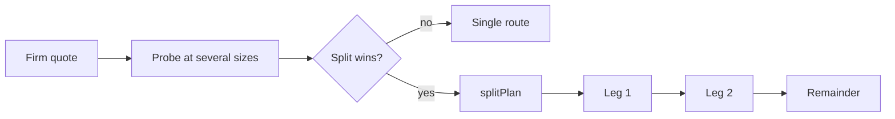

A bridge quote is a curve, not a rate. On a large order the engine probes the corridor at several sizes, measures how each venue's price moves, and offers a split when an allocation across venues beats the best single route.

## On the quote

Only a firm (non-indicative), exact-input quote above the asset's floor is probed.

| Field | Meaning |
| --- | --- |
| `splitPlan` | An allocation across venues with `improvementBps` against the single winner and `maxSignatures`, the most wallet prompts it can take. |
| `twapPlan` | A time-sliced schedule, offered when it beats the best immediate plan. Off unless enabled; suppressed by `autoTwapOptOut: true`. |
| `planReason` | Why neither is offered: `below_floor`, `single_venue_best` or `no_improvement`. Absent when nothing was evaluated. |

Both plans are priced net of the platform fee at the winning row's rate.

## Executing a split

<Steps>
  <Step title="Accept the plan">
    `POST /bridge/plan/accept` with `{ "decisionId", "plan": "split" }` records the choice on the decision.
  </Step>
  <Step title="Start">
    `POST /bridge/split/start` returns the order: `groupId`, every leg, and `next`, which is a full build response for leg one.
  </Step>
  <Step title="Sign, submit, repeat">
    Submit leg one like any transfer. Once it is terminal, `POST /bridge/split/next` re-quotes the remainder against live prices, builds the next leg and returns it in `next`. Calling it while a leg is in flight is `409 leg_in_flight`.
  </Step>
</Steps>

Each leg is a full fan-out for the remaining amount, so the venue that fills leg two is often not the one the plan named. `GET /bridge/split/groups/{id}` reports the order: `routedInAtomic`, `unfilledInAtomic`, `realizedOutAtomic`, `savedVsBaselineBps` and every leg with its `plannedVenue`, actual `venue` and `reroute` reason. The number of legs is capped; when the cap is reached the remainder goes out as one leg.
