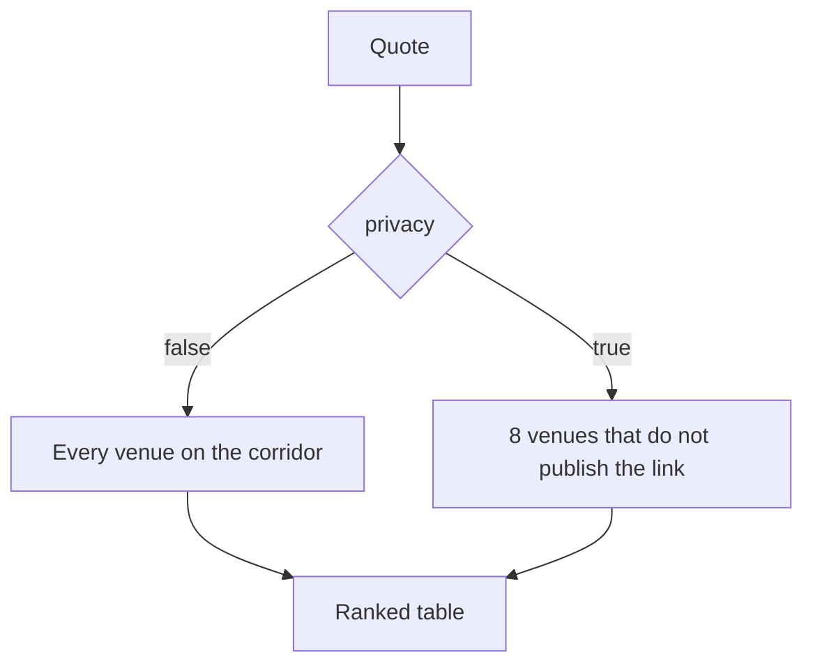

Most bridges put both of your addresses in one transaction, on chain, forever. `privacy: true` on a quote restricts routing to venues that do not publish that link. 8 of the 36 venues qualify.

## What qualifies

Each venue was checked against one question, using only its own documentation: does a transfer through it break the on-chain link between the sending and receiving address? Where the documentation was ambiguous the answer is no.

| `privacyModel` | Meaning | Venues |
| --- | --- | --- |
| `unlinkable` | The link is broken by construction: a shielded hop or a confidential settlement layer. | Husher, NEAR Intents |
| `custodial-hop` | The on-chain trail stops at the venue's deposit address. The venue itself knows both sides. | ChangeNOW, SimpleSwap, SideShift, SWFT, Layerswap, Socket |
| `none` | An ordinary bridge. Not offered under `privacy`. | the other 28 |

`GET /bridge/venues` reports the model per venue.

## The two unlinkable venues

**Husher** routes the swap through a Monero or Zcash shielded transaction. About 1% and about five minutes on top of the normal route. Husher's own terms: it is not a mixer, traceability is reduced rather than eliminated, and the exchange providers behind it can apply their own compliance checks.

**NEAR Intents** settles a private request as a confidential intent on a permissioned shard with no public explorer; the payout arrives as an ordinary transfer from a solver. No extra cost or time stated. The shard supports selective disclosure for auditors.

## What it does not promise

- Amount and timing still correlate at the edges. A distinctive sum leaving one chain and arriving on another minutes later is visible without touching the protocol.
- An exchange desk keeps the pairing between deposit and payout and can ask for identity after funds have moved.
- Nothing is mixed. This reduces traceability; it does not guarantee anonymity.

## In the API

- `privacy: true` on `POST /bridge/quote`, `POST /bridge/watch` and `POST /bridge/build`.
- Public venues are dropped before pricing, each listed in `rejected` as `privacy_venue_required`.
- When no qualifying venue serves the corridor the response carries `emptyReason: "no_private_route"`.
- `GET /bridge/routes?privacy=true` lists the qualifying venues for a corridor.
- Building a public venue against a private decision is `409 privacy_venue_required`.
