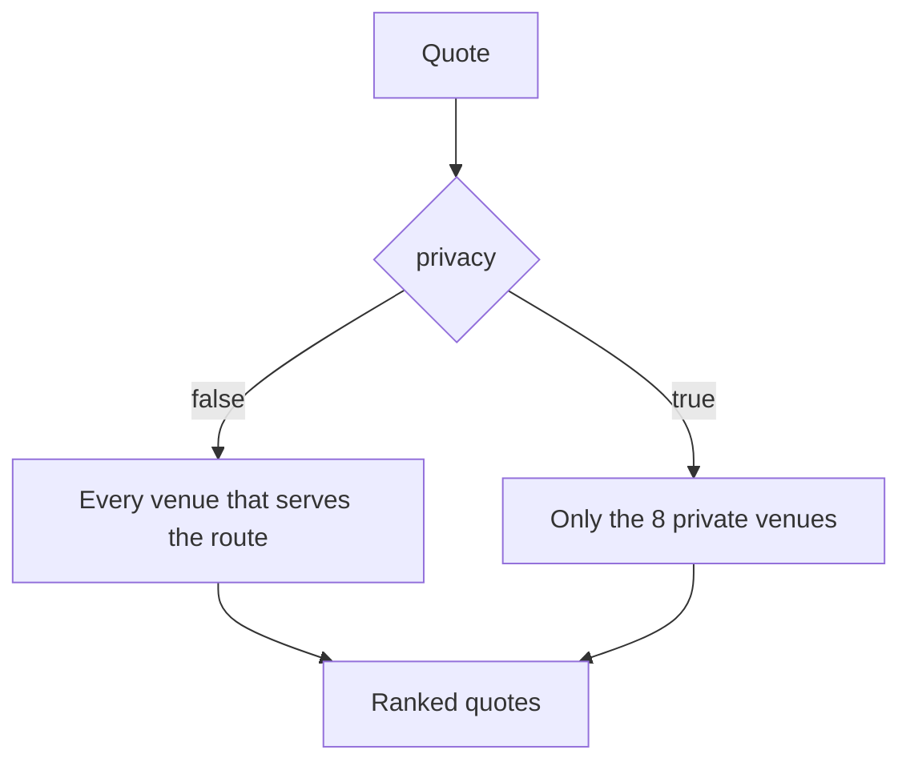

Most bridges record the sending and receiving addresses together on chain, where anyone can see them. Setting `privacy: true` on a quote limits routing to venues that do not publish that link. 8 of the 36 venues qualify.

```mermaid
flowchart TD
    Q["Quote"] --> M{"privacy"}
    M -->|false| A["Every venue that serves the route"]
    M -->|true| F["Only the 8 private venues"]
    A --> R["Ranked quotes"]
    F --> R
```

## Which venues qualify

Each venue was assessed against one question, using only its own documentation: does a transfer through it break the on-chain link between the sending and receiving address? If the documentation was unclear, the answer was no.

| `privacyModel` | Meaning | Venues |
| --- | --- | --- |
| `unlinkable` | The link is broken by design, through a shielded transaction or a private settlement layer. | Husher, NEAR Intents |
| `custodial-hop` | The on-chain trail ends at the venue's deposit address. The venue itself still knows both sides. | ChangeNOW, SimpleSwap, SideShift, SWFT, Layerswap, Socket |
| `none` | An ordinary bridge. Never used for a private transfer. | The other 28 |

`GET /bridge/venues` returns each venue's `privacyModel`.

## The two unlinkable venues

**Husher** routes the swap through a Monero or Zcash shielded transaction. It costs roughly 1% more than a standard route. Husher's own terms say it is not a mixer, that traceability is reduced rather than eliminated, and that the exchange providers behind it can apply their own compliance checks. Husher needs the end user's IP address, so send `userIp` if you call the API from a server.

**NEAR Intents** settles a private transfer as a confidential intent on a private network with no public explorer. The payout arrives as an ordinary transfer from a solver. That network supports selective disclosure to auditors.

## Limits of private routing

- Amount and timing can still link the two sides. A distinctive amount leaving one chain and arriving on another a few minutes later can be matched without looking at the venue at all.
- An exchange desk keeps a record of which deposit matched which payout, and can ask for identity after funds have moved.
- Nothing is mixed. Private routing makes a transfer harder to trace; it does not make it anonymous.

## Using it in the API

- Send `privacy: true` on `POST /bridge/quote`. It carries over to `POST /bridge/build`.
- Venues that are not private are skipped before pricing and listed in `rejected` with the code `privacy_venue_required`.
- If no private venue serves the route, the quote has `emptyReason: "no_private_route"`.
- `GET /bridge/routes?privacy=true` lists the private venues for a route.
- Building a non-private venue against a private quote is refused with `409 privacy_venue_required`.
