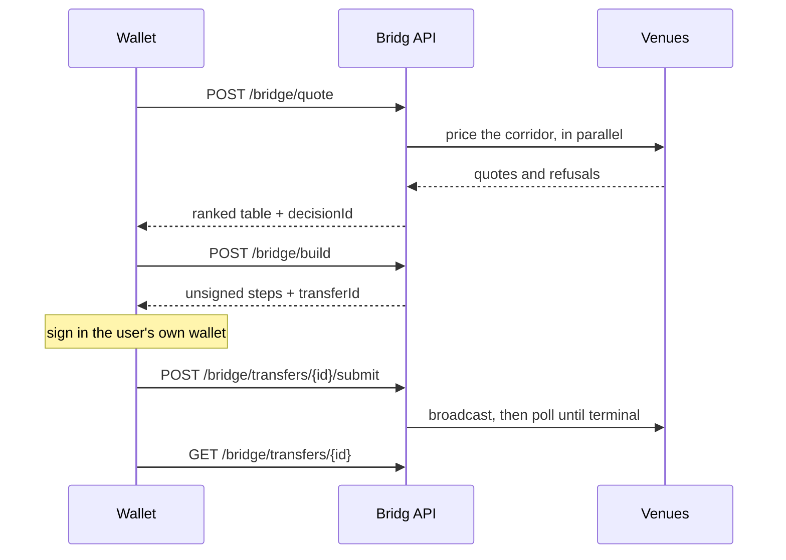

<Steps>
  <Step title="Quote">
    One request fans out to every venue whose catalog serves the corridor. Each answers with a price, its own fees and an ETA, or is recorded in `rejected` with a reason. Rows are ranked on net output in the asset's atomic units. See [Ranking](/concepts/ranking).
  </Step>
  <Step title="Build">
    Building a decision returns the unsigned transactions for the chosen row: an approval where one is needed, the platform fee step where the venue has no fee parameter, then the bridge call. The transfer record is opened before the steps are returned, so it can be tracked even if nothing is ever signed.
  </Step>
  <Step title="Sign">
    The user's wallet signs the steps in order. Bridg has no signer and no key. Wallets with EIP-5792 batching sign the fee and bridge steps as one bundle.
  </Step>
  <Step title="Submit">
    Hand back either the signed bytes, which Bridg broadcasts through its own nodes, or the hash of a transaction the wallet already sent. Either way the transaction is checked against the steps that were built. Anything else is refused.
  </Step>
  <Step title="Track">
    A poller reads the venue until the transfer reaches a terminal state. Every transition is also published on a realtime channel, and the transfer endpoint always answers. See the [status vocabulary](/api-reference/quote/transfer).
  </Step>
</Steps>

Signing in is optional. Quote, build and submit are open. A session, obtained by signing a message with the wallet, is only needed to list your own orders.
