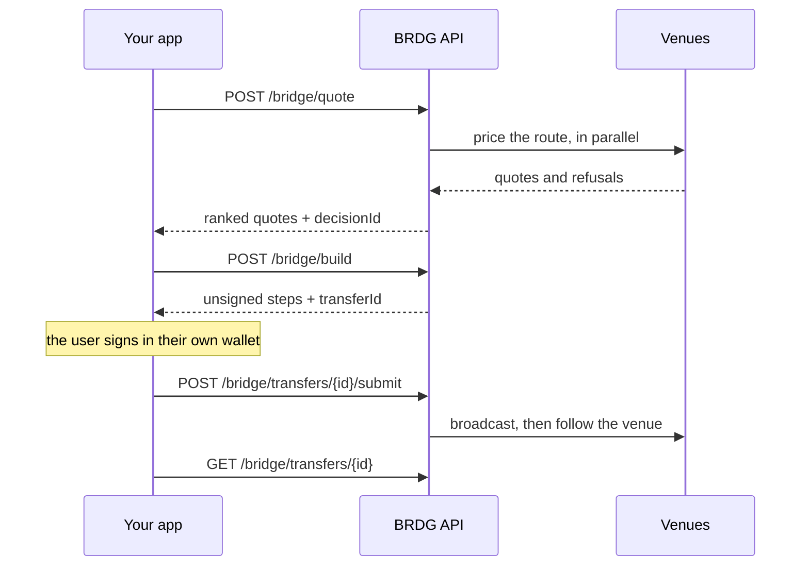

A transfer takes four API calls. Signing happens in between, in your user's wallet.

```mermaid
sequenceDiagram
    participant W as Your app
    participant B as BRDG API
    participant V as Venues
    W->>B: POST /bridge/quote
    B->>V: price the route, in parallel
    V-->>B: quotes and refusals
    B-->>W: ranked quotes + decisionId
    W->>B: POST /bridge/build
    B-->>W: unsigned steps + transferId
    Note over W: the user signs in their own wallet
    W->>B: POST /bridge/transfers/{id}/submit
    B->>V: broadcast, then follow the venue
    W->>B: GET /bridge/transfers/{id}
```

<Steps>
  <Step title="Quote">
    BRDG asks every venue that serves the route for a price. Each one answers with an output amount, its fees and an estimated time, or appears in `rejected` with the reason it could not quote. The answers are ranked by net output. See [Ranking](/concepts/ranking).
  </Step>
  <Step title="Build">
    Building a quote returns the unsigned transactions for the route you chose: a token approval if one is needed, a fee transfer if the venue cannot collect the fee itself, then the bridge transaction. The transfer is recorded at this point, so you can look it up by id even if the user never signs.
  </Step>
  <Step title="Sign">
    The user's wallet signs the steps in order. BRDG never signs anything for the user. Wallets that support EIP-5792 batching can sign the fee and bridge steps as a single bundle.
  </Step>
  <Step title="Submit">
    Send BRDG either the signed transaction, which it broadcasts for you, or the hash of a transaction the wallet already sent. BRDG checks it against the steps it built and refuses anything that does not match.
  </Step>
  <Step title="Track">
    BRDG follows the transfer with the venue until it finishes. Read `GET /bridge/transfers/{id}` whenever you want the current status. The statuses are listed in [Track a transfer](/guides/track-a-transfer).
  </Step>
</Steps>

None of these calls need an API key or an account. They are subject to [rate limits](/api-reference/rate-limits).
